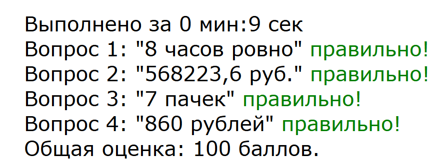

# testjax
Работа с тестами на сконфигурированными на странице html  
Такая работа может понадобиться в html констукторах, например в тильде.  
Оформление вопросов не ограничено никакими условиями кроме служебной разметки.  
Ответы на вопросы определяются параметрами в теге <script> и добавляются на эту же страницу.  
Для конфигурации ответов рекомендуется произвести замену на ничего по регулярному выражению: ** \s*\n\s* ** Тогда всё форматирование параметров ответов будет в одну строку, что затруднит возможность списывания для тестируемых учеников. И конечно не относитесь слишком серьёзно к данному варианту тестирования!  
Для работы теста необходимо его сконфигурировать примерно так:  
```html
    <script type="text/javascript">
        const questions = [
            [
                {question: "8 часов 40 минут", answer: 0},
                {question: "8 часов ровно", answer: 1},
                {question: "9 часов ровно", answer: 0},
                {question: "9 часов 40 минут", answer: 0},],
            [
                {question: "81174,8 руб.", answer: 0},
                {question: "536060 руб.", answer: 0},
                {question: "568223,6 руб.", answer: 1},
                {question: "459480", answer: 0},],
            [
                {question: "4 пачки", answer: 0},
                {question: "5 пачек", answer: 0},
                {question: "6 пачек", answer: 0},
                {question: "7 пачек", answer: 1},],
            [
                {question: "850 рублей", answer: 0},
                {question: "860 рублей", answer: 1},
                {question: "900 рублей", answer: 0},
                {question: "1000 рублей", answer: 0},],
        ]
    </script>
```
Каждый вариант ответа прицепиться автоматом к соответствующему по счету варианту вопроса.

Вопросы сконфигурированы так: 
```html
    <div class="question" id="1">
        <h2>Вопрос 1</h2>
        <div></div>
        <p>Поезд отправился из Санкт-Петербурга в 23 часа 50 минут (время московское) и прибыл в Москву в 7 часов 50
            минут следующих суток. Сколько часов поезд находился в пути?</p>
    </div>
```

Сколько вопросов, столько должно быть параметров  
Смотри пример на странице public/index.html а так же как нужно обратить на наличие кнопоки Начать: 
```html
<div class="start">
    <button id="buttonStart">Начать</button>
</div>
```

Нужно обратить внимание на наличие кнопки завершения теста: 

```html
    <div class="end">
        <button id="buttonDone">Отправить на проверку</button>
    </div>
```

Кнопка завершения теста должна находиться внутри скрытого блока:  
```html
<div class="questions" id="rootQuestions" style="display: none">
... вопросы
... кнопка завершения
</div>
```
По результатам выполнения теста выводится общее время выполнения, правильные и неправильные ответы, и общий бал


Как это может выглядеть:  
