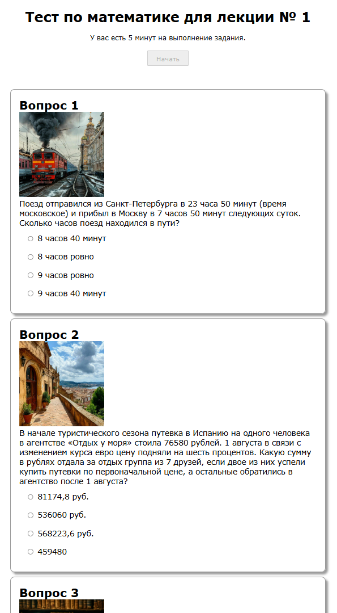

# testjax

Работа с тестами на сконфигурированными на странице html  
Такая работа может понадобиться в html констукторах, например в тильде.  
Оформление вопросов не ограничено никакими условиями кроме служебной разметки.  
Ответы на вопросы определяются параметрами в теге <script> и добавляются на эту же страницу.  
Для конфигурации ответов рекомендуется произвести замену на ничего по регулярному выражению: ** \s*\n\s* ** Тогда всё
форматирование параметров ответов будет в одну строку, что затруднит возможность списывания для тестируемых учеников. И
конечно не относитесь слишком серьёзно к данному варианту тестирования!

## Можно использовать mathjax (mathjax.org)

Подключить mathjax можно через cdn:

```html

<script id="MathJax-script" async src="https://cdn.jsdelivr.net/npm/mathjax@3/es5/tex-mml-chtml.js"></script>

```

Вариант конфигурации параметров ответов:

```html

<script type="text/javascript">
    const questions = [
        [
            {question: "16", answer: 0},
            {question: "40", answer: 1},
            {question: "1600", answer: 0},
            {question: "400", answer: 0},],
        [
            {question: "Вариант А", answer: 0},
            {question: "Вариант Б", answer: 0},
            {question: "Вариант В", answer: 1},
            {question: "Вариант Г", answer: 0},],
        [
            {question: "4", answer: 0},
            {question: "16", answer: 0},
            {question: "-1", answer: 0},
            {question: "-4", answer: 1},],
        [
            {question: "Вариант А", answer: 1},
            {question: "Вариант Б", answer: 0},
            {question: "Вариант В", answer: 0},
            {question: "Вариант Г", answer: 0},],
        [
            {question: "Вариант А", answer: 0},
            {question: "Вариант Б", answer: 0},
            {question: "Вариант В", answer: 0},
            {question: "Вариант Г", answer: 1},],
    ]
</script>
```

Каждый вариант ответа прицепиться автоматом к соответствующему по счету варианту вопроса.

Вопросы сконфигурированы так:

```html

<div class="question" id="1">
    <div class="question" id="1">
        <h2>Вопрос 1</h2>
        <p>\[\sqrt{58^2-42^2}-?\]</p>
    </div>
</div>
```

Можно использовать любое форматирование, в том числе изображения или формулы в ответах. Но тогда следует обозначить ответы как варианты:
```html
<div class="question" id="2">
        <h2>Вопрос 2</h2>
        <p class="bigCenter">\[(a^{2m})^{m/2}-?\]</p>
        <table style="width: 100%">
            <tr>
                <th>
                    A:
                </th>
                <th>
                    Б:
                </th>
                <th>
                    В:
                </th>
                <th>
                    Г:
                </th>
            <tr>
                <td>
                    \[a^m\]
                </td>
                <td>
                    \[a^{{2\over 3}*m}\]
                </td>
                <td>
                    \[a^{m^2}\]
                </td>
                <td>
                    \[a^{m^2+{5\over 2}}\]
                </td>
            </tr>
        </table>
    </div>
```

Сколько вопросов, столько должно быть параметров  
Смотри пример на странице public/index.html а так же как нужно обратить на наличие кнопоки Начать:

```html

<div class="start">
    <button id="buttonStart">Начать</button>
</div>
```

Нужно обратить внимание на наличие кнопки завершения теста:

```html

<div class="end">
    <button id="buttonDone">Отправить на проверку</button>
</div>
```

Кнопка завершения теста должна находиться внутри скрытого блока:

```html

<div class="questions" id="rootQuestions" style="display: none">
    ... вопросы
    ... кнопка завершения
</div>
```

По результатам выполнения теста выводится общее время выполнения, правильные и неправильные ответы, и общий бал
